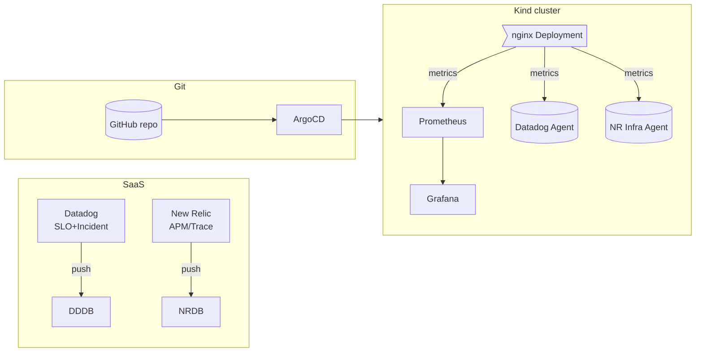

# Mini Cloud‑Native Platform 🇪🇺

> **Showcasing my ability to master unfamiliar SRE tooling in < 3 hours** – built by **Shuhei Kato**, an AWS‑seasoned Cloud Engineer now seeking Site Reliability / Platform roles across the EU (relocating to the Netherlands).

---

## 🚀 TL;DR for busy recruiters

|                       | Link                                                                             | What to look at                                                    |
| --------------------- | -------------------------------------------------------------------------------- | ------------------------------------------------------------------ |
| 🎥 quick demo        | **Loom:** [URL](https://www.loom.com/share/28524a199dfb4a86bc4ed46723af5f14?sid=032d7246-2179-4320-97ad-715335432705)                   | Live walk‑through of failure injection → auto‑healing → dashboards |
| 🗂 Source repo        | *This GitHub repo*                                                               | Inspect IaC, GitOps, NetworkPolicy, Helm values                    |

**Why it matters** — I have years of AWS infrastructure experience but *no prior hands‑on* with Datadog / New Relic / Helm / Prometheus & Grafana. This project proves I can **pick up new observability stacks fast, wire them together, and articulate results**.

---

## 🔥 What I actually built (and why it’s impressive in 3 h)

| Layer      | Tool                     | Why it’s here                                 | Hiring‑signal                      |
| ---------- | ------------------------ | --------------------------------------------- | ---------------------------------- |
| Runtime    | **Kind**                 | Reproducible single‑node Kubernetes in Docker | Local K8s competency               |
| GitOps     | **Argo CD**              | Declarative sync from Git ➜ cluster           | Modern delivery workflows          |
| Metrics DB | **Prometheus + Grafana** | OSS baseline, custom SLI rule                 | DIY monitoring roots               |
| SaaS #1    | **Datadog**              | Org‑level SLO & Incident feed                 | Can onboard 3rd‑party SaaS quickly |
| SaaS #2    | **New Relic**            | APM / OTLP traces                             | Polyglot observability             |
| Security   | **NetworkPolicy**        | Default‑deny micro‑segmentation demo          | Zero‑Trust mindset                 |

🚧 **Failure demo** – scaling `nginx` to 0 triggers:

1. Prometheus Rule → Datadog SLO breach (visible on public dashboard)
2. Argo CD self‑heal sets replicas = 1
3. Metrics & error‑budget instantly recover

Time‑boxed tasks & commit timestamps are in the Git history for transparency.

---

## 🗺 High‑level architecture



---

## 🧑‍💻 Setup & Reproduce this demo

Full terminal guide moved to **[`setup.md`](./setup.md)** to keep this README recruiter‑friendly. Two commands if you’re curious:

```bash
kind create cluster --name demo     # spin up local K8s
kubectl apply -f k8s/argocd/app.yaml  # Argo CD syncs the rest
```

*(Requires Helm, kubectl, Kind; SaaS keys as env vars.)*

---

## ✨ Key take‑aways for hiring managers

* **Fast learner:** went from zero to functional Datadog/New Relic stack in one evening.
* **Production habits:** GitOps, SLOs, NetworkPolicy – not just “Hello World”.
* **Clear communication:** demo video, public dashboards, this concise README.
* **EU relocation‑ready:** already based in CET timezone, English + Japanese.

> “Give me 30 days with your platform and I will light up red / yellow / green health signals your devs actually trust.”

---

## 📇 About me

- **Name**: **Shuhei Kato**
- **Contact**
    - [LinkedIn](https://linkedin.com/in/your-profile)
    - [Email](mailto:me@example.com)
