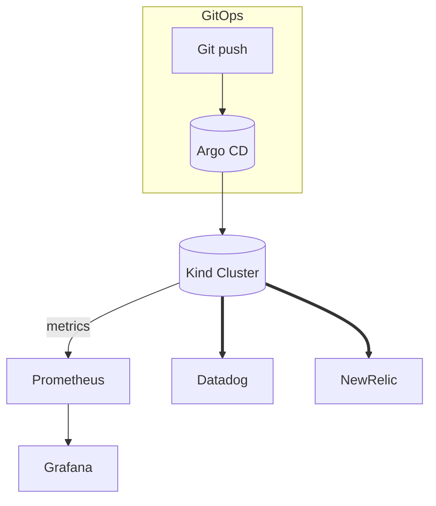

# Mini Cloud‑Native Platform (⏱ 3‑Hour Challenge)

> **Goal:** Demonstrate that I can **pick up unfamiliar cloud‑native tools and wire them together in <3 h**. The repo + this page are optimized for recruiters who just want to click and see results.

---

## 📌 Quick Links

| What                      | Link                             | Status  |
| ------------------------- | -------------------------------- | ------- |
| 🎥 **90‑sec Demo Video**  | *TBD: paste Loom URL*            | ⬜ TODO  |
| 📊 **Live SLO Dashboard** | *TBD: paste Datadog Public link* | ⬜ TODO  |
| 🗂 **Source Repository**  | *This GitHub repo*               | ✅ Ready |

> **Tip:** replace the “*TBD*” placeholders as soon as each artefact is ready, then commit.

---

## 🚀 Quickstart in VSCode Terminal (15 min)

> Open VS Code’s integrated terminal with \*\*Ctrl+`** (Cmd+` on macOS). Examples show both *Bash/zsh* and *PowerShell* where syntax differs.

```bash
# 0. Clone the repo and open workspace
git clone https://github.com/kshukshu/Mini-Cloud-Native-Platform.git
cd Mini-Cloud-Native-Platform
code .     # optional: launch VS Code here
```

### 1. CLI prerequisites

```bash
# macOS / Linux (Bash, zsh)
brew install kind kubectl helm

# Windows (PowerShell)
winget install -e --id Kubernetes.kind
winget install -e --id Kubernetes.kubectl
winget install -e --id Helm.Helm
```

### 2. Spin up a local cluster

```bash
kind create cluster --name demo
```

### 3. Add Helm repositories

```bash
helm repo add argo https://argoproj.github.io/argo-helm
helm repo add prometheus-community https://prometheus-community.github.io/helm-charts
helm repo add datadog https://helm.datadoghq.com
helm repo add newrelic https://helm-charts.newrelic.com
helm repo update
```

### 4. Set your SaaS API keys

```bash
# Bash / zsh
export DATADOG_API_KEY="<your-datadog-key>"
export NEW_RELIC_LICENSE_KEY="<your-nr-license-key>"

# PowerShell (VS Code default on Windows)
$Env:DATADOG_API_KEY="<your-datadog-key>"
$Env:NEW_RELIC_LICENSE_KEY="<your-nr-license-key>"
```

<details>
  <summary>Where do I get these keys?</summary>

| SaaS          | Free plan / Trial                    | Steps to obtain API Key / License Key                                                                                                                                                                                                                                                                                                                                        |
| ------------- | ------------------------------------ | ---------------------------------------------------------------------------------------------------------------------------------------------------------------------------------------------------------------------------------------------------------------------------------------------------------------------------------------------------------------------------- |
| **Datadog**   | 14‑day full trial (no credit card ⬤) | 1. Go to [https://app.datadoghq.com/signup](https://app.datadoghq.com/signup) and create an account.<br>2. **E‑mail** を確認してワンタイムパスでログイン。<br>3. ナビゲーションバー **Integrations → APIs** へ移動。<br>4. *API Keys* タブで **+ New Key** → 任意の名前を付けて **Create Key**。<br>5. 生成された文字列をそのまま `DATADOG_API_KEY` にコピー。<br>⬥ US サイト ↔ EU アカウントの場合は `datadoghq.eu` を Helm に渡す（Quickstart Step 5 参照）。 |
| **New Relic** | ⬤ **全機能無料プラン** (100 GB/月) + クレカ不要    | 1. Sign up at [https://newrelic.com/signup](https://newrelic.com/signup) (email + password).<br>2. Once logged in, click your profile avatar → **API Keys**.<br>3. Under *Ingest – License* tab, click **+ Create a key**.<br>4. Copy the **License key** string → `NEW_RELIC_LICENSE_KEY`.                                                                                  |

`⬤` = No credit card required (2025‑06時点)

</details>bash
# Bash / zsh
export DATADOG_API_KEY="<your-datadog-key>"
export NEW_RELIC_LICENSE_KEY="<your-nr-license-key>"

# PowerShell (VS Code default on Windows)

\$Env\:DATADOG\_API\_KEY="<your-datadog-key>"
\$Env\:NEW\_RELIC\_LICENSE\_KEY="<your-nr-license-key>"

````

### 5. Deploy Argo CD & the monitoring stack
```bash
# Bash/zsh version (back‑slash line continuations)
helm install argocd argo/argo-cd --namespace argocd --create-namespace
helm install mon prometheus-community/kube-prometheus-stack --namespace monitoring --create-namespace
helm install dd datadog/datadog \
  --set datadog.apiKey=$DATADOG_API_KEY \
  --set datadog.site="datadoghq.com" --namespace datadog --create-namespace
helm install nr newrelic/nri-bundle \
  --set global.licenseKey=$NEW_RELIC_LICENSE_KEY \
  --set global.cluster="kind-demo" \
  --namespace newrelic --create-namespace

# PowerShell version (use back‑tick ` for continuation)
helm install dd datadog/datadog `
  --set datadog.apiKey=$Env:DATADOG_API_KEY `
  --set datadog.site="datadoghq.com" --namespace datadog --create-namespace
helm install nr newrelic/nri-bundle `
  --set global.licenseKey=$Env:NEW_RELIC_LICENSE_KEY `
  --set global.cluster="kind-demo" `
  --namespace newrelic --create-namespace
````

### 6. Register this repo as an Argo CD application

> If `k8s/argocd/app.yaml` does **not yet exist**, create it with the snippet below, commit, and push. Otherwise skip to the *kubectl apply* step.

```bash
# 6‑A. Generate the manifest (one‑time)
mkdir -p k8s/argocd
cat > k8s/argocd/app.yaml <<'EOF'
apiVersion: argoproj.io/v1alpha1
kind: Application
metadata:
  name: mini-cloud-native
  namespace: argocd
spec:
  destination:
    namespace: default
    server: https://kubernetes.default.svc
  project: default
  source:
    repoURL: https://github.com/kshukshu/Mini-Cloud-Native-Platform.git
    targetRevision: HEAD
    path: k8s
    directory:
      recurse: true   # 🔑 allow manifests in sub‑directories (k8s/nginx/*)
  syncPolicy:
    automated:
      prune: true
      selfHeal: true
EOF

git add k8s/argocd/app.yaml
git commit -m "Add Argo CD Application manifest"
git push
```

```bash
# 6‑B. Apply the manifest to Argo CD
kubectl apply -f k8s/argocd/app.yaml
```

### 7. Open Argo CD dashboard Open Argo CD dashboard

```bash
kubectl port-forward svc/argocd-server -n argocd 8080:443
# → browse https://localhost:8080  (user: admin, pw: $(kubectl -n argocd get secret argocd-initial-admin-secret -ojsonpath='{.data.password}' | base64 -d))
```

### 8. Git push → Auto‑sync demo

```bash
touch k8s/nginx/dummy.txt
git add .
git commit -m "trigger sync"
git push
```

Watch Argo CD turn the app **Healthy & Synced** within \~30 s.

### 9. Incident simulation

```bash
kubectl scale deploy/nginx --replicas=0   # Inject failure
sleep 120                                 # Wait for Datadog alert
kubectl scale deploy/nginx --replicas=1   # Recover
```

<details>
  <summary>Cluster teardown</summary>

```bash
kind delete cluster --name demo
```

</details>

---

## 🛠 Architecture at a Glance



* All components deploy via **Helm charts** to keep YAML authoring nearly zero.
* **Zero‑Trust / Microsegmentation** achieved with `NetworkPolicy` default‑deny + per‑namespace allows.

---

## 🧩 Component Roles & Differences

### Stack Layout (conceptual)

```text
┌────────────────────────── Observability SaaS ──────────────────────────┐
│  Datadog ─ SLO / Alerting / Incident   New Relic ─ APM / Tracing      │
└──────────────────────────────▲──────────────────────────────▲──────────┘
                               │  (metrics / traces pushed via OTLP)     
┌────────────────────────── In‑Cluster Monitoring ───────────────────────┐
│  Prometheus ─ scrape K8s metrics & custom SLI, rule eval               │
│  Grafana ─ dashboards (bundled)                                        │
└──────────────────────────────▲─────────────────────────────────────────┘
                               │  deployed by GitOps                     
┌────────────────────────── GitOps Controller ───────────────────────────┐
│  Argo CD ─ watches Git, applies manifests, shows drift                 │
└──────────────────────────────▲─────────────────────────────────────────┘
                               │  runs on local Kubernetes               
┌────────────────────────── Local Cluster ───────────────────────────────┐
│  Kind ─ single‑node Kubernetes in Docker, reproducible dev env         │
└────────────────────────────────────────────────────────────────────────┘
```

### Quick Comparison Table

| Dimension              | Kind                                | Argo CD                                                   | Prometheus                          | Datadog                            | New Relic                          |
| ---------------------- | ----------------------------------- | --------------------------------------------------------- | ----------------------------------- | ---------------------------------- | ---------------------------------- |
| **Category**           | Local Kubernetes distro             | GitOps controller                                         | Metrics DB & alert rules            | SaaS observability (all‑in‑one)    | SaaS observability (APM/traces)    |
| **Runtime location**   | Developer laptop (Docker)           | In‑cluster                                                | In‑cluster                          | Cloud                              | Cloud                              |
| **Key responsibility** | Provide K8s runtime for dev/testing | Keep cluster state = Git                                  | Collect & store metrics; fire rules | Central SLO/alert/incident console | Deep‑dive APM + telemetry explorer |
| **Data it handles**    | Pods, Services                      | YAML manifests                                            | Metrics (K8s, app)                  | Metrics, logs, traces, SLO objs    | Traces, metrics, logs              |
| **Alert engine**       | —                                   | Sync health                                               | PrometheusRules                     | Datadog Monitors/SLO               | NR Alerts                          |
| **UI**                 | `kubectl` CLI                       | Web UI ([https://localhost:8080](https://localhost:8080)) | Grafana dashboards                  | Web app                            | Web app                            |
| **Cost**               | Free                                | OSS                                                       | OSS                                 | SaaS (free trial)                  | SaaS (free trial)                  |
| **Why keep it**        | Reproducible local cluster          | Declarative & auditable deploys                           | Fast local metrics & custom SLI     | Organization‑wide view & paging    | Complementary APM & OTLP ingestion |
| **Overlap**            | —                                   | —                                                         | Feeds metrics to SaaS               | Ingests Prom tail & OTLP           | Ingests OTLP traces & metrics      |

---

## ✅ Capabilities Checklist

| Keyword                         | Proof point                                                  |
| ------------------------------- | ------------------------------------------------------------ |
| **Kubernetes**                  | local Kind cluster running the workload                      |
| **Docker**                      | public `nginx:alpine` image pulled by workload               |
| **Terraform**                   | *Optional*: `terraform-kubernetes-manifest` file in `/infra` |
| **ArgoCD**                      | GitOps auto‑sync after every `git push`                      |
| **GitOps**                      | see above (ArgoCD)                                           |
| **Datadog**                     | agent Helm chart + public dashboard                          |
| **Grafana**                     | comes from `kube-prometheus-stack`                           |
| **New Relic**                   | OpenTelemetry export via Helm bundle                         |
| **SLO/SLI**                     | PrometheusRule + Datadog SLO "95 % availability / 2 min"     |
| **Incident Response / On‑Call** | Datadog monitor → Slack webhook (`@here`)                    |
| **Zero‑Trust**                  | `deny-all.yaml` + `allow-from-ingress.yaml`                  |
| **Microsegmentation**           | NetworkPolicy limits traffic to service port only            |

---

## 🔔 Incident Simulation Steps (recorded in demo)

1. **Inject failure**

   ```bash
   kubectl scale deploy/nginx --replicas=0
   ```

2. Datadog SLO breaches → Slack alert fires.
3. **Recover**

   ```bash
   kubectl scale deploy/nginx --replicas=1
   ```

4. Dashboard turns green again.

---

## 💰 Cost Footprint

| Resource                  | Cost               |
| ------------------------- | ------------------ |
| Kind cluster              | \$0 (local)        |
| Datadog & New Relic trial | \$0 (14‑day trial) |
| GitHub Pages / Loom       | \$0                |

---

## ✍️ Author

**Shuhei Kato**
*Loves fast feedback loops & observability‑driven ops*
[LinkedIn](https://linkedin.com/in/your-profile) · [Email](mailto:your@email)
