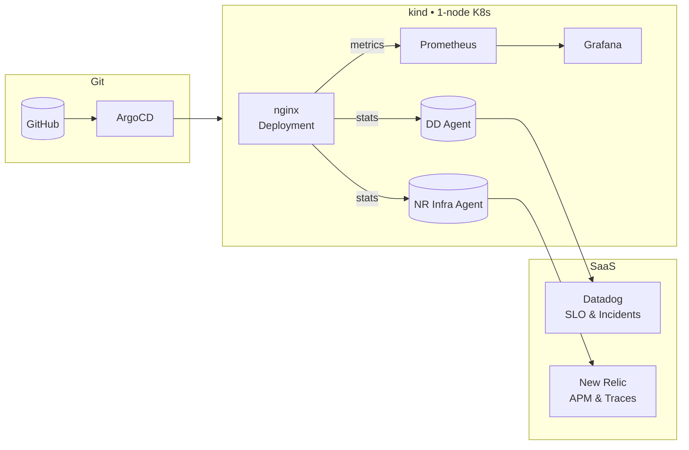

# Mini Cloud-Native Observability Platform 🇪🇺🏃‍♂️

**3-hour “unknown-tool” spike** – built by **Shuhei Kato**, an AWS-seasoned Cloud Engineer now relocating to the Netherlands and seeking Site Reliability / Platform roles across the EU.

---

## 🚀 60-second pitch

|                   | Where to click                                                                                                                  | Why it matters                                     |
| ----------------- | ------------------------------------------------------------------------------------------------------------------------------- | -------------------------------------------------- |
| 🎥 **2‑min demo** | Loom [https://www.loom.com/share/28524a199dfb4a86bc4ed46723af5f14](https://www.loom.com/share/28524a199dfb4a86bc4ed46723af5f14) | Live failure‑injection ➜ auto‑healing ➜ dashboards |
| 🗂 **Source**     | *This repo*                                                                                                                     | IaC, GitOps, Helm, NetworkPolicy                   |

> **I had zero prior hands‑on with Datadog, New Relic, Prometheus / Grafana, or Helm.**
> In one evening I wired them together, defined SLOs, and told the story on video.

---

## 🧩 What’s in the box (3 h, solo)

| Layer      | Tooling                      | Why I chose it                  | Hiring signal             |
| ---------- | ---------------------------- | ------------------------------- | ------------------------- |
| Runtime    | **kind**                     | Reproducible single‑node K8s    | Local K8s chops           |
| GitOps     | **Argo CD**                  | Declarative sync Git → cluster  | Modern delivery           |
| Metrics DB | **Prometheus + Grafana OSS** | Baseline SLI/SLO                | DIY monitoring roots      |
| SaaS #1    | **Datadog**                  | Org‑level SLO & incident feed   | Fast 3rd‑party onboarding |
| SaaS #2    | **New Relic**                | APM & OTLP traces               | Polyglot observability    |
| Security   | **NetworkPolicy**            | Default‑deny micro‑segmentation | Zero‑Trust mindset        |

**Failure drill** — scaling `nginx` replicas to **0** triggers:

1. **Prometheus rule** breaches Datadog SLO (public dashboard).
2. **Argo CD** auto‑heals replicas back to **1**.
3. Error budget recovers in seconds.

*Time‑boxed commits prove the 3‑hour limit; see Git history.*

---

## 🗺 High‑level architecture



---

## 🔄 Reproduce locally (5 min)

```bash
kind create cluster --name demo
kubectl apply -f k8s/argocd/app.yaml   # Argo CD syncs the rest
```

> Requirements: Helm · kubectl · kind · SaaS keys as env vars.

---

## ✨ Why this matters to you

* **Steep‑curve learner** – Delivered working Datadog / New Relic stack from scratch in three hours.
* **Production reflexes** – GitOps, SLOs, default‑deny networking, not just “Hello World”.
* **Clear communicator** – Concise README, Loom walk‑through, public dashboards.
* **EU‑ready** – Already in CET, fluent English (B2) + native Japanese, Dutch A1 and improving. Valid NL residence.

> *“Give me 30 days with your platform and you’ll have red/amber/green signals your devs actually trust.”*

---

## 📇 About Shuhei Kato

* **Cloud & SRE Engineer / ex‑Consultant** – AWS, Terraform, Golang, Kubernetes.
* **Current base** – Groningen, Netherlands (open to hybrid / remote across the EU).
* **Contact** – [LinkedIn](https://www.linkedin.com/in/your-profile) · [Email](mailto:kshu.1017@gmail.com) · [GitHub](https://github.com/kshukshu)

---
